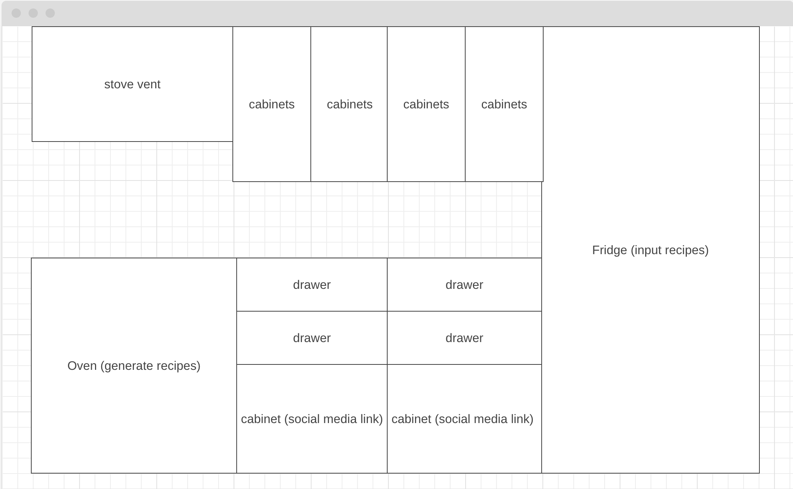

# Welcome to miKitchen!

   miKitchen is a unique and engaging data visualization project that allows users to explore and interact with a 2D representation of a kitchen. In this interactive kitchen, users can click on different parts of the kitchen, and each piece of furniture or appliance serves a specific function or provides valuable information. Whether you're a cooking enthusiast, a nutrition-conscious individual, or simply curious, this project is designed to offer a fun and informative experience. The primary purpose of this project is to create an interactive kitchen environment that not only engages users but also educates them about cooking, nutrition, and the relationship between ingredients and recipes. By allowing users to interact with various kitchen elements, the project aims to provide an immersive learning experience that combines practical kitchen tasks with informative data visualization.

## Key Features

In miKitchen, users will be able to:

- Click on the fridge to select ingredients. This feature provides a practical way to simulate the process of gathering ingredients for a recipe.
- Refine their recipe choices by diet, cuisine, allergies, and more.
- Click on the stove to generate a recipe based on the selected ingredients.
- Discover new dishes and cooking ideas while seeing the macronutrient breakdowns of the recipe. This feature empowers users to make informed and healthy culinary choices.

In addition, this project will include:

- A production README
- Social media links

## Wireframe 

## Technology Stack

This project will be implemented with the following technologies:
- JavaScript: The core language used to implement the interactive functionality.
- HTML/CSS: To create the user interface and layout of the 2D kitchen.
- Edamam Recipe Search API

## Development Schedule

### Thursday (Day 1): Project Setup and Learning API
- Set up the project, create a GitHub repository, and configure the development environment (Webpack, VS Code).
- Learn how to use the Edamam API, review DOM manipulation, event handling, and fetch.
- Study solutions to relevant projects (AJAX Twitter, Vanilla DOM, Browser Tic Tac Toe).

### Friday (Day 2): Implementing Fridge Feature
- Begin writing code to allow users to input ingredients by clicking on the fridge.
- Continue developing the fridge feature with minimal styling and a focus on functionality.
- Plan out the desired styling.

### Saturday (Day 3): Implementing Oven Feature
- Start building the oven feature to generate recipes based on the selected ingredients.
- Continue developing the oven feature with minimal styling and a focus on functionality.
- Plan out the desired styling.

### Sunday (Day 4): Recipe Refinement Feature and Data Visualization Planning
- Design and implement the "Recipe Drawer" feature for refining recipes.
- Research data visualization and plan its implementation.
- Explore UI/UX design options for the recipe drawer.
- Continue planning data visualization.

### Monday (Day 5): Detailed Styling and Asset Integration
- Dedicate time to styling the kitchen with more detailed CSS.
- Begin searching for kitchen art assets online.
- Continue with detailed styling, ensuring hover and click functionalities work with new art assets.
- Extend the search for kitchen art assets.

### Tuesday (Day 6): Detailed Styling and Data Visualization Implementation
- Focus on detailed styling, refining the visual aspects of the kitchen environment.
- Continue searching for kitchen art assets.
- Implement data visualization features, integrating them into the project.

### Wednesday (Day 7): Final Styling and Testing
- Finalize the styling to ensure your kitchen environment looks polished.
- Perform thorough testing, including testing the recipe refinement and data visualization features, and address any last-minute issues.

## Bonus Features

In addition to the core functionality of the interactive miKitchen, project updates might include:

1. **Calorie and Macronutrient Tracking System**
   - Users can specify daily calorie and macronutrient goals (protein, carbohydrates, and fats).
   - Track daily calorie and macronutrient intake by adding different recipes to their breakfast, lunch, and dinner plans.

2. **Meal Planner**
   - Create a meal planning feature that allows users to schedule and organize their daily meals.
   - Users can add recipes to their meal plans to meet their calorie and macronutrient goals for each meal.

3. **Save Favorite Recipes**
   - Allow users to save their favorite recipes for quick and easy access.
   - Users can build a collection of preferred recipes to use in their meal plans.

